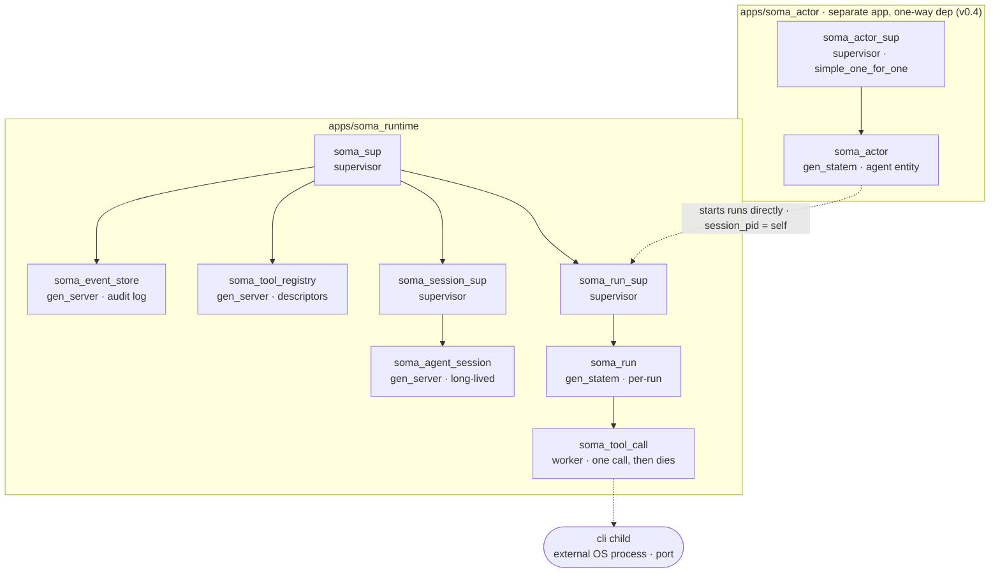
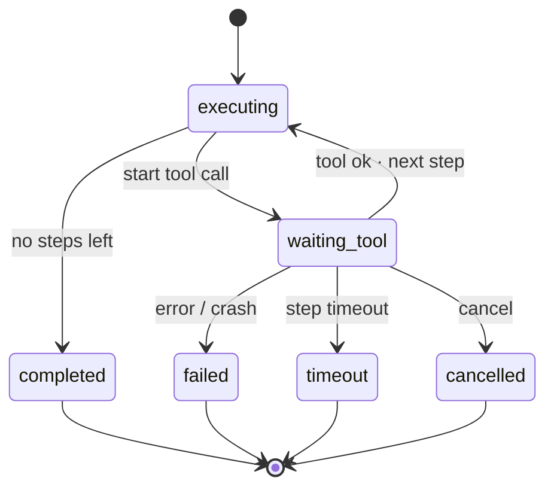
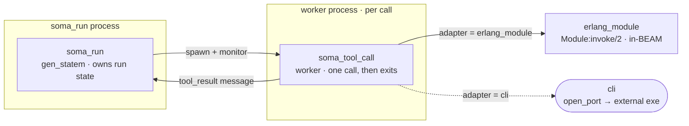

# Soma

Soma is an Erlang/OTP-native agent runtime. It proves one idea:

```text
An agent run is a supervised OTP process tree, not a function that loops over
tool calls.
```

Erlang/OTP provides the execution semantics — timeouts, cancellation, monitoring,
crash isolation — while the step list only says *what* to run. The full rationale
and design live in **[docs/design.md](docs/design.md)**, the project's north star.

The Lisp-flavored DSL is Soma's first **agent intent language**: a constrained
syntax for an agent to describe bounded operational intent. Lisp is not the
runtime and the compiler does not evaluate arbitrary Lisp; the hard boundary is
`Lisp at the edge -> validated data -> OTP execution`.

**Status — built and green on `main`** (EUnit 247, Common Test 334, Erlang/OTP 29).
Every layer is proven under test, asserting *process survival*, not just return
values. Full layer-by-layer status: **[docs/roadmap.md](docs/roadmap.md)**.

| Runtime layer (foundation → newest) — all built ✓ | What it adds |
| --- | --- |
| **v0.1–0.2** · Runtime core | supervised runs · timeout / cancel / crash · BEAM + CLI tools |
| **v0.3** · LFE DSL | compile-only Lisp → step lists |
| **v0.4** · Agent entity | `soma_actor` (`gen_statem`): messages → tasks → runs |
| **v0.5** · Decision layer | LLM-call worker · proposals · policy gate · budgets |
| **v0.6** · Durability + observability | `soma_trace` timelines · `disk_log` store, survives restart |
| **v0.7.1** · Resume journal | `run.started` journal + read-only reconstruct from the trail |

Two tracks build in parallel: a real **OpenAI-compatible LLM provider** (opt-in, off the
gate) and the **`soma` CLI / daemon** — `run` / `ask` / `status` / `cancel` / `trace` over a
local Unix socket, Lisp on the wire. Not yet built: the **resume executor** (replay a run
from its reconstructed snapshot) and the **Linux x86_64 / arm64 release** (macOS arm64 is done).

## The idea

Soma is built on the **actor model**: every session, run, and tool call is an
*actor* — an isolated process with a private mailbox that talks only by messages.
Erlang is the canonical actor runtime; OTP then layers supervision and monitoring
on top, turning plain actors into *actors that fail safely*. That second layer is
the point.

Agent systems fail in operational ways: model calls hang, tools time out,
external programs crash, sessions stay alive for a long time, cancellation has to
be real, and every run needs an audit trail — and one run's failure must not
poison the whole session. Erlang/OTP was built for exactly this class of problem
(telecom-grade failure isolation). Soma uses those primitives directly —
processes, mailboxes, supervision, `gen_statem`, monitors, timers, ports —
instead of reimplementing weaker versions of them in a language that wasn't built
for it. See [docs/design.md](docs/design.md) for the full thesis.

## Architecture



A tool crash is **data for the run, not a crash of the session**: `soma_run`
monitors each worker, so a crash arrives as a `'DOWN'` message.

- **`soma_agent_session`** (`gen_server`) owns a `session_id`, accepts run
  requests, starts runs, tracks them, and **survives any run's failure**. It
  never executes tools itself.
- **`soma_run`** (`gen_statem`) owns one run. Terminal states are explicit:
  `completed | failed | timeout | cancelled`. It iterates the steps internally
  (its `executing` / `waiting_tool` states are the step cursor) and starts each
  tool call as a **monitored** worker.
- **`soma_tool_call`** runs exactly one tool invocation in its own process and
  exits. It dispatches on the tool's adapter: an `erlang_module` tool runs
  in-BEAM via `invoke/2`; a `cli` tool launches an external executable through a
  port. Every tool call crosses a process boundary; a tool crash arrives at the
  run as a monitor `'DOWN'` — **data for the run, not a crash of the session**.
- **`soma_actor`** (`gen_statem`, the v0.4 agent-entity layer) is a separate
  OTP app (`apps/soma_actor`) that sits *above* the execution core — one-way
  dependency, the runtime never imports it. Its own root supervisor
  (`soma_actor_sup`, `simple_one_for_one`) starts actor instances. An actor
  takes work as a **message** (`send/2`, `ask/3`), mints `task_id` /
  `correlation_id`, and on a steps envelope starts a `soma_run` **directly**
  (it owns the run as `session_pid => self()`, no session in its path). It
  observes the run's terminal message, records the result, and survives a
  failed / timed-out / cancelled run as data — the actor never executes tool
  logic itself.



A timeout or cancel kills the active worker (and, for a `cli` tool, its external
OS process) before the run settles.

## Quick start

Prerequisites: Erlang/OTP 29 and rebar3.

```bash
rebar3 compile
rebar3 eunit && rebar3 ct      # 247 EUnit + 334 Common Test, all green
```

Drive a run in the shell:

```bash
rebar3 shell
```

```erlang
{ok, S} = soma_agent_session:start_link(#{}).
{ok, RunId} = soma_agent_session:start_run(S, [
    #{id => greet, tool => echo, args => #{value => <<"hello">>}}
]).
soma_agent_session:get_status(S).
%% => #{session_id => <<"sess-1">>, runs => #{<<"run-1">> => completed}}
```

### The demo: `file_read -> echo -> file_write`

```erlang
file:make_dir("/tmp/somademo"), file:write_file("/tmp/somademo/in.txt", <<"hi soma">>).
{ok, S} = soma_agent_session:start_link(#{}).
Steps = [#{id => read,  tool => file_read,  args => #{path => <<"in.txt">>,  root => "/tmp/somademo"}},
         #{id => echo,  tool => echo,       args => #{from_step => read}},
         #{id => write, tool => file_write, args => #{path => <<"out.txt">>, root => "/tmp/somademo", bytes => {from_step, echo}}}].
{ok, _RunId} = soma_agent_session:start_run(S, Steps).
file:read_file("/tmp/somademo/out.txt").   %% => {ok, <<"hi soma">>}
```

A run executes asynchronously; `get_status/1` reflects its terminal status once
it finishes.

### Drive an actor (v0.4)

The `soma_actor` layer takes a message and runs it for you. `ask/3` blocks for
the result:

```erlang
application:ensure_all_started(soma_actor).
{ok, Store} = soma_event_store:start_link().
{ok, A} = soma_actor_sup:start_actor(#{actor_id => <<"a1">>,
                                       model_config => #{}, tool_policy => #{},
                                       event_store => Store}).
soma_actor:ask(A, #{type => <<"chat">>, payload => #{},
                    steps => [#{id => s1, tool => echo,
                                args => #{value => <<"hello">>}}]}, 5000).
%% => {ok, #{s1 => #{value => <<"hello">>}}}
```

`examples/soma_actor_demo.erl` walks the rest — `send` + polling, the
`by_correlation/2` event chain, real mid-run cancellation, and surviving a
failure (`c("examples/soma_actor_demo").` in the shell). The full actor API is
in [docs/usage.md](docs/usage.md).

## What it does

- **Sequential steps.** A step is `#{id, tool, args, timeout_ms}`. `args` may
  carry `from_step => StepId` (feed a prior step's whole output in) or a field
  like `bytes => {from_step, StepId}` (feed it into one field).
- **A process per tool call.** Tool results come back to the run as messages; the
  run owns all state. Each invocation runs in its own `soma_tool_call` worker.
- **Tool manifests + a descriptor registry.** A tool declares itself with a
  manifest (a data map) validated by `soma_tool_manifest:normalize/1`; a manifest
  missing a required field is rejected and never resolves. `soma_tool_registry`
  holds the normalized descriptors, and a run resolves a tool to its descriptor —
  which names the **adapter** that runs it.
- **In-BEAM and external CLI tools.** An `erlang_module` tool runs `invoke/2` in
  the BEAM. A `cli` tool runs an external executable once, through a port
  (executable + argv, **never a shell string**), in its own worker: the step
  input is delivered as the final argv argument, stdout is captured as the step
  output, and exit status 0 is success — with a minimal environment (only `PATH`)
  and a fixed working directory.
- **Real failure semantics.** A tool returning `{error, _}` fails the run; a tool
  process that crashes is absorbed and the session survives; a hanging tool is
  killed by a per-step timeout — and for a `cli` tool the **external OS process is
  torn down too** (lifecycle teardown), not just the BEAM worker; a run can be
  cancelled mid-flight (`SessionPid ! {cancel_run, RunId}`), which also stops the
  external process. A CLI tool's operational failures — a missing/unrunnable
  executable, a nonzero exit, oversized output — are **failure normalization**
  into named, bounded `{error, _}` data. Through all of it the session keeps
  serving: it runs again after any terminal state.
- **An LFE DSL compile-only layer** (`soma_lfe`). `soma_lfe:compile(Source, #{})` parses a small Lisp-flavored grammar into the exact step-list maps `start_run/2` accepts — no processes started, no events emitted, no runtime dependency. This is a constrained intent language for agents and humans to author runs; it is not a Lisp evaluator. Compilation returns `{ok, #{run => #{steps => Steps}}}` or `{error, [Diagnostic]}` with structured diagnostic codes. See [docs/lfe-dsl.md](docs/lfe-dsl.md).
- **An agent-entity layer** (`soma_actor`, v0.4). A long-lived `gen_statem`
  takes a message envelope through `send/2` (async, returns `{ok, TaskId}`) or
  `ask/3` (blocks the caller for the result), mints `task_id` / `correlation_id`,
  and emits `actor.message.received` / `actor.task.accepted`. A fixed rule —
  envelope carries `steps` → validate → start a `soma_run` the actor owns —
  drives execution; on the run's terminal message the actor records the result
  (`actor.result.created` / `actor.task.completed`) or the failure
  (`actor.task.failed` / `actor.task.cancelled`) and stays alive. Results are
  available three ways: `ask/3` reply, `get_task_status/2` + `get_task_result/2`
  polling, and the event stream — `soma_event_store:by_correlation/2` returns the
  whole task chain (actor *and* run events) under one `correlation_id`.
  `cancel/2` cancels a task's active run for real (the tool worker is killed).
- **An agent decision layer** (`soma_actor`, v0.5). An envelope can carry an
  `llm` directive instead of `steps`: the actor starts a **supervised, monitored,
  cancellable LLM-call worker** (`soma_llm_call`, owned directly — no
  `soma_llm_call_sup`, mirroring `soma_run → soma_tool_call`), which returns a
  **proposal**. `soma_proposal:normalize/1` validates the proposal into tagged
  data (`reply` / `run_steps` / `reject` / `ask` / `actor_message`); a pure policy
  gate `soma_policy:check/2` allows or rejects it against a tool-name allowlist;
  and only an **approved** `run_steps` proposal starts a `soma_run`. A per-task
  `budget` fails the task (not the actor) on exhaustion, and an approved
  `actor_message` delivers to another actor under the sender's `correlation_id`.
  It emits `llm.*` and `proposal.*` events on the same chain. The test gate still
  drives this layer with the mock LLM, but `soma_llm_call:perform_call/1` now also
  routes `#{provider => openai_compat}` calls to `soma_llm_openai`.
- **A mandatory event log** (in-memory by default) records the whole run, each
  event carrying 8 fields (`event_id, timestamp, session_id, run_id, step_id,
  tool_call_id, event_type, payload`): `session.started -> run.accepted ->
  run.started ->` per step `step.started -> tool.started -> tool.succeeded ->
  step.succeeded -> ... -> run.completed` (or `run.failed` / `run.timeout` /
  `run.cancelled`). Actor-layer events add `actor.*` types and an
  `actor_id` / `task_id` / `correlation_id` extension; a `soma_run` started by an
  actor stamps the `correlation_id` onto every run event too.
- **A durable event store, opt-in** (v0.6). The store also has a `disk_log`
  backend: start it with a log path and `append/2` writes each event to the
  durable log *and* the in-memory index, replaying the log on boot to rebuild the
  index — so events survive a BEAM restart. The in-memory store stays the default;
  the prod release turns persistence on by setting one app env
  (`event_store_log`), and the `by_*` query API does not change. The principle is
  **the durable log is the source of truth, the in-memory index is a rebuildable
  cache**.
- **A readable trace view** (v0.6). `soma_trace:render/2` takes one
  `correlation_id` and renders the whole chain as a timestamp-ordered timeline,
  one line per event (`actor.* -> llm.* -> run.* -> step.* -> tool.* ->
  actor.*`); `soma_trace:timeline/1` is the pure renderer over a list of event
  maps. Read-only, it turns the event stream into an operational view without
  changing it.



On timeout / cancel, `soma_run` kills the worker — and a `cli` tool's external OS
process with it, shell-free (no `os:cmd`).

Every guarantee is proven by a test that asserts **process survival, not just
return values**. The runtime proofs live in `apps/soma_runtime/test/`; the full
proof→test map (a `cli` tool succeeds through the real layers, a hanging or
cancelled `cli` run leaves no live external process, a CLI failure fails the run
not the session, …) is **[docs/contracts/v0.2-test-contract.md](docs/contracts/v0.2-test-contract.md)**.

## Tools

A tool is a behaviour with `describe/0` and `invoke/2`; its spec declares an
`effect` (`identity | reader | state`), `idempotent`, and `timeout_ms`, and it
registers through a manifest naming its adapter. Built-in tools (in-BEAM,
`erlang_module` adapter): `echo`, `sleep`, `fail` (for tests — error and crash
modes), `file_read`, `file_write` (sandboxed under a `root`). External tools use
the `cli` adapter — executable + argv, never shell strings, with explicit `argv`,
`env`, and `cwd` handling; a packaged sample helper ships at
`apps/soma_tools/priv/cli/soma_sample_upper`. The manifest shape and the cli
execution protocol are in **[docs/tool-manifest.md](docs/tool-manifest.md)**.

## Release

```bash
rebar3 as prod tar
```

builds a self-contained release that bundles ERTS and runs without Erlang
installed → `_build/prod/rel/soma/soma-0.1.0.tar.gz`. macOS arm64 is built and
verified; the Linux x86_64 / arm64 artifacts build the same `prod` profile on
those hosts and are the remaining packaging work. See
**[docs/release.md](docs/release.md)**.

## Scope

In scope: the runtime, sequential steps, supervised in-BEAM and one-shot CLI
tools, real timeout/cancellation, normalized failures, the event log (in-memory,
with an opt-in durable `disk_log` backend) and a read-only trace view
(`soma_trace`), a compile-only LFE DSL layer (`soma_lfe`), the `soma_actor`
agent-entity skeleton, the agent decision layer (`soma_llm_call` + proposal schema
+ policy gate + decision-loop execution + budgets + actor-to-actor), the
OpenAI-compatible real-provider path, the Lisp message/proposal/trace/repair
edge forms, local Unix-socket CLI server/client modules, and a self-contained
release.

Out of scope (later roadmap layers, see **[docs/roadmap.md](docs/roadmap.md)**): a
structured real-model planner that emits tool-running proposals, an effect-aware
policy gate, MCP, DAG parallelism, distributed Erlang, resuming a run's
*execution* from its journal (v0.7.1's journal + read-only progress
reconstruction are in; the resume executor is not), and a packaged external
`soma run` / `soma ask` command distinct from the relx node control script.

## Docs

**Reference**

- **[docs/design.md](docs/design.md)** — north star: thesis, runtime shape, and
  the non-negotiable constraints. Where the implementation refined the design
  (e.g. step iteration lives inside `soma_run`, not a separate `soma_step`
  process), this README and the code are authoritative.
- **[docs/usage.md](docs/usage.md)** — API reference: starting the runtime,
  registering tools, starting runs, reading events, cancellation, actor messages,
  and provider configuration.
- **[docs/tool-manifest.md](docs/tool-manifest.md)** — tool manifest contract:
  the shape of a tool entry, which adapter runs it, and the cli execution
  protocol.
- **[docs/lfe-dsl.md](docs/lfe-dsl.md)** — LFE DSL: syntax reference,
  run step-list contract, Lisp edge forms, `from_step` forms, diagnostic codes,
  and explicit non-goals. The `soma_lfe` app is a compile-only layer with no
  runtime dependency on `soma_runtime`.
- **[docs/release.md](docs/release.md)** — building and running the release.
- **[docs/roadmap.md](docs/roadmap.md)** — future layers beyond the current
  build and status for the parallel node B / CLI / Lisp tracks.

**Test contracts**

- **[docs/contracts/v0.2-test-contract.md](docs/contracts/v0.2-test-contract.md)**
  — process-behaviour proofs for manifests and the CLI adapter: each property
  mapped to the suite and test case that proves it.
- **[docs/contracts/v0.3-test-contract.md](docs/contracts/v0.3-test-contract.md)**
  — process-behaviour proofs for the LFE DSL compiler layer: compile-only
  boundary, validation, parser, and runtime integration.
- **[docs/contracts/v0.4-test-contract.md](docs/contracts/v0.4-test-contract.md)**
  — process-behaviour proofs for the `soma_actor` agent-entity layer: actor
  start, task creation, run integration, result model, correlation lookup,
  survival under failure / crash, and cancellation. The twelve in-scope proofs
  (P1–P11, P15) are green; P12 and P13 are delivered in v0.5, and P14 remains
  deferred.
- **[docs/contracts/v0.5-test-contract.md](docs/contracts/v0.5-test-contract.md)**
  — process-behaviour proofs for the agent decision layer: the LLM-call worker
  (distinct pid, timeout / cancel / crash become task data, the actor stays
  responsive), proposal normalization, the policy gate, decision-loop execution,
  budget exhaustion, and actor-to-actor `correlation_id` propagation — each
  mapped to its suite and case. Mock-LLM on the gate.
- **[docs/contracts/v0.6-test-contract.md](docs/contracts/v0.6-test-contract.md)**
  — persistence proofs for the durable `disk_log` event store: an appended event
  reads back from the log as its normalized form, a restart at the same path
  replays the log so `all/1` / `by_run/2` / `by_correlation/2` return the events
  in append order, and a truncated tail boots and still serves the intact events
  — while the in-memory default writes no file and queries unchanged.
- **[docs/contracts/L.1-test-contract.md](docs/contracts/L.1-test-contract.md)**
  through **[docs/contracts/L.5-test-contract.md](docs/contracts/L.5-test-contract.md)**
  — Lisp edge-language proofs: message envelopes, actor-to-actor Lisp delivery,
  Lisp proposals, Lisp trace/rendering, and bounded proposal repair.
- **[docs/contracts/cli-1b-test-contract.md](docs/contracts/cli-1b-test-contract.md)**,
  **[docs/contracts/cli-2-test-contract.md](docs/contracts/cli-2-test-contract.md)**,
  and **[docs/contracts/cli-3-test-contract.md](docs/contracts/cli-3-test-contract.md)**
  — local Unix-socket Lisp-wire proofs for `soma_cli` / `soma_cli_server` run,
  ask, status, trace, cancel, and detach behavior.

**Chinese docs**

- **[docs/zh/what-is-soma.zh.md](docs/zh/what-is-soma.zh.md)** — overview of
  Soma, the `soma_actor` agent entity, and the execution path.
- **[docs/zh/soma-actor.zh.md](docs/zh/soma-actor.zh.md)** — soma_actor complete
  design: actor entity, message-driven trigger, actor loop, decision frame,
  policy gate, LLM call, result model, event contract, memory model, and
  minimum scope. The v0.4 build implemented the minimal fixed-rule slice; v0.5
  added the LLM call, proposal schema, policy gate, budgets, and actor-to-actor
  messaging, and the current provider path can call an OpenAI-compatible endpoint
  when configured.
- **[docs/zh/erlang-otp-primer.zh.md](docs/zh/erlang-otp-primer.zh.md)** —
  Erlang/OTP primer (BEAM, process, mailbox, gen_server, gen_statem, supervisor,
  port, release) for readers unfamiliar with Erlang.
