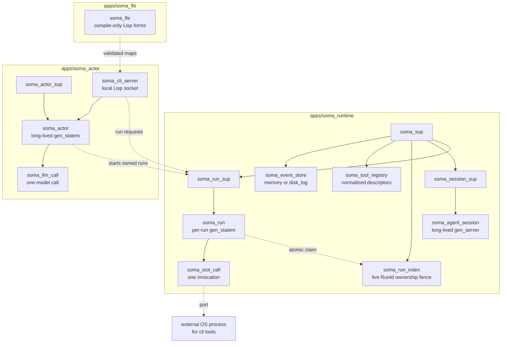
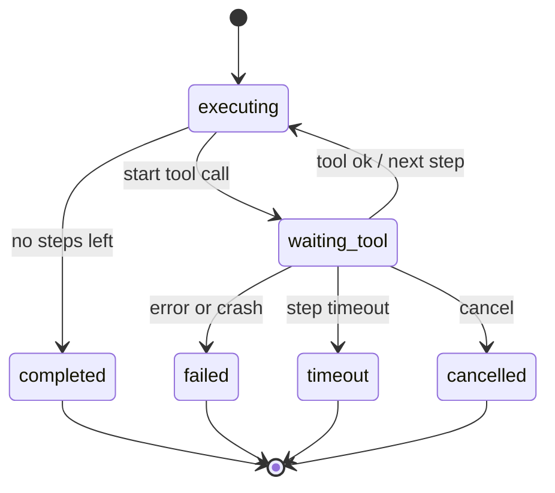

# Soma Design

Soma is an Erlang/OTP-native agent runtime. Its central claim is:

```text
An agent run is a supervised OTP process tree, not a function that loops over
tool calls.
```

Lisp is the public edge language for workflows, messages, CLI requests, replies,
and audit rendering. Erlang/OTP is the internal execution substrate: processes,
mailboxes, monitors, timers, ports, and supervisors provide the runtime
semantics.

For commands and examples, see [cli.md](cli.md) and [lfe-dsl.md](lfe-dsl.md).
This document records the architectural shape and the invariants that code and
tests must preserve.

## Thesis

Agent systems fail in operational ways:

- model calls hang;
- tools time out;
- external programs crash;
- sessions and actors stay alive for a long time;
- cancellation must stop real work, not just flip a flag;
- every run needs an audit trail;
- failures must not poison the parent session or actor.

Soma uses OTP because these are process problems. A session, run, tool call,
actor, and model call are separate processes. They communicate by messages, and
failure crosses boundaries as data.

## Architecture

The runtime core is small and sequential. Higher layers compile intent into the
same canonical run contract instead of turning `soma_run` into a workflow engine.

Soma Lisp source -> soma_lfe:compile/2 -> validated maps -> OTP execution.



Core boundaries:

- `soma_agent_session` owns session identity, starts runs, tracks terminal
  status, and survives failed, timed-out, and cancelled runs. It never executes
  tools.
- `soma_run` owns one execution attempt: step cursor, prior outputs, active
  worker, timers, cancellation, resume metadata, and event emission.
- `soma_run_index` owns the one-live-pid-per-RunId mapping. A run claims before
  journalling or executing, and a monitor releases the claim only after that
  exact pid dies. The index is supervised separately from `soma_run_sup`.
- Runtime-owned in-memory and durable event stores are registered as
  `soma_runtime_event_store`. The `soma_sup` child id stays
  `soma_event_store`, and existing APIs continue to accept the resolved pid.
- `soma_tool_call` executes exactly one tool invocation and exits. Every tool
  call crosses this process boundary.
- `soma_actor` sits above the runtime. It owns tasks, correlation ids, proposal
  handling, policy, budgets, LLM-call workers, actor-to-actor messages, and
  owned runs. The runtime does not import `soma_actor`.
- `soma_llm_call` is a disposable worker owned by `soma_actor`; there is no
  `soma_llm_call_sup`.
- `soma_cli_server` exposes the local task surface over a Unix socket. The
  packaged user command is `bin/soma`; the release node-control script is
  `bin/somad`.
- `soma_lfe` is compile-only. It parses constrained Lisp edge forms into maps
  consumed by the runtime, actor, and CLI server. It starts no processes and
  emits no runtime events.

## Current Scope

Soma currently includes:

- sequential supervised runs;
- in-BEAM tools and one-shot external CLI tools;
- normalized tool manifests and descriptor registry;
- timeout, cancellation, crash isolation, and external OS process teardown;
- mandatory event emission, in-memory event store, durable `disk_log` event
  store, and Lisp trace rendering;
- persistent resume from the event trail: journal, read-only reconstruction,
  planning, a manual resume executor, default boot auto-resume, and upper-layer
  recovery for explicit owner-managed runs, with fail-safe handling for unsafe
  in-flight state steps;
- compile-only Lisp forms for runs, messages, proposals, ask/status/trace/cancel
  commands, and audit rendering;
- long-lived `soma_actor` task ownership with proposal normalization, policy,
  budgets, actor-to-actor messages, and owned runs;
- mock LLM execution for deterministic local runs, an opt-in OpenAI-compatible
  provider path, and actor-level planning mode that reads provider text as a
  Lisp `(run-steps ...)` proposal when `model_config` carries `plan => true`;
- productized real-model planning through CLI/config conventions;
- local single-user CLI/daemon commands: `run`, `ask`, `status`, `trace`,
  `cancel`, `stop`, and `daemon`;
- self-contained release packaging.

Still open:

- effect-aware policy;
- log/index compaction;
- Linux release artifacts.

Out of scope for the current core:

- DAG or parallel step execution;
- distributed Erlang;
- arbitrary Lisp evaluation;
- MCP as the primary local control surface;
- multi-tenant socket authentication or isolation.

## Run State Machine

`soma_run` is a `gen_statem`. Step iteration lives inside the run process through
`executing` and `waiting_tool`; there is no separate `soma_step` worker.



The run owns:

- step cursor;
- committed step outputs;
- active tool-call pid;
- active external OS pid when a CLI tool is running;
- timers;
- cancellation;
- event emission;
- resume metadata.

Tool results return to the run as messages. A tool crash arrives as monitor
`DOWN` and becomes run data; it is not a session or actor crash.

## Agent Entity

`soma_actor` is the long-lived agent entity above the execution core. Work enters
as a message envelope with `task_id` and `correlation_id`. The actor updates
task state, starts child workers, receives results as messages, and records the
task outcome.

Non-negotiable actor rules:

- LLM output is a proposal, not execution.
- Proposals re-enter normalization, policy, and budget checks before any action.
- Approved run proposals start owned `soma_run` processes under `soma_run_sup`.
- Actor-to-actor proposals deliver messages while preserving `correlation_id`.
- LLM timeout, crash, cancellation, rejection, and budget exhaustion are task
  data, not actor crashes.
- `correlation_id` propagates through actor events, LLM calls, runs, and
  actor-to-actor messages so the event trail can reconstruct the whole chain.

The real-provider path is selected by daemon/actor model config. Tests remain
hermetic by default and use mock or fixed-response seams.

The full actor design notes live in [zh/soma-actor.zh.md](zh/soma-actor.zh.md).

## Planning And Lisp

The runtime does not care where steps came from. A human, CLI command, LLM
planner, UI, or repair loop must compile intent down to the same canonical
step-list contract.

Lisp is used at Soma's edges because it is compact and tree-shaped. It is not a
general-purpose Lisp runtime. `soma_lfe:compile/2` parses a constrained language
and returns validated maps or diagnostics. It does not evaluate arbitrary code.

The boundary is:

```text
Lisp source -> soma_lfe:compile/2 -> validated maps -> runtime / actor APIs
```

Malformed Lisp proposals may enter bounded repair, but repaired output still
goes through normal normalization, policy, and budget checks. Repair is never a
bypass.

## Steps

The canonical runtime step is a small map with `id`, `tool`, `args`, and optional
`timeout_ms`. Execution is strictly sequential. `args` can pass a prior step's
whole output with `from_step`, or pass a prior output into a specific field with
the field-level `from_step` form.

There is no branching, looping, DAG scheduling, variable environment, or planner
logic inside `soma_run`. Higher-level forms must compile down to the canonical
step list.

## Tool Runtime

Tools implement the `soma_tool` behaviour. The registry stores normalized
descriptors, not bare modules. Runtime resolution goes through the descriptor so
the run dispatches by adapter.

The `erlang_module` adapter runs trusted in-BEAM tools. The `cli` adapter runs a
single external executable through an Erlang port. Both adapters still cross the
same `soma_tool_call` worker boundary.

Built-in tools include `echo`, `sleep`, `fail`, `file_read`, `file_write`,
`text_grep`, and `text_head`. Tool manifest details are in
[tool-manifest.md](tool-manifest.md).

## External Processes

External tools use executable plus argv, never shell command strings. The CLI
adapter launches the executable through a port, passes the step input as an argv
argument, captures stdout as the step output, and normalizes operational failure
into bounded error data.

Timeout and cancellation tear down both the BEAM worker and the external OS
process. A missing executable, unrunnable executable, nonzero exit, oversized
output, crash, timeout, or cancellation must not crash the session or actor.

## Event Log

Events are mandatory. The event log is the source of truth for run traces,
correlation traces, durability, and resume.

Core run events include:

- `session.started`;
- `run.accepted`;
- `run.started`;
- `run.resumed`;
- `step.started`;
- `tool.started`;
- `tool.succeeded` / `tool.failed`;
- `step.succeeded` / `step.failed`;
- `run.completed` / `run.failed` / `run.timeout` / `run.cancelled`.

Actor and decision events include:

- `actor.started`;
- `actor.message.received`;
- `actor.task.accepted`;
- `proposal.created`;
- `proposal.repaired`;
- `proposal.approved` / `proposal.rejected`;
- `proposal.executed`;
- `actor.result.created`;
- `actor.task.completed` / `actor.task.failed` / `actor.task.cancelled`;
- `llm.started`;
- `llm.succeeded` / `llm.failed` / `llm.timeout` / `llm.cancelled`.

Run events carry ids such as `event_id`, `timestamp`, `session_id`, `run_id`,
`step_id`, `tool_call_id`, `event_type`, and `payload`. Actor/LLM/proposal
events extend the trail with ids such as `actor_id`, `task_id`,
`correlation_id`, and `llm_call_id`.

Provider secrets and API keys must never be emitted into events.

## Resume

Resume is driven from durable events. A run journals its submitted steps and
durable run options in `run.started`. Reconstruction reads the trail back and
derives committed outputs, the next uncommitted step, durable options, and
terminal status without starting processes or appending events.

Manual resume uses the reconstructed trail to start a fresh `soma_run` for the
pending suffix. Committed outputs are seeded into the resumed run. A resumed run
emits `run.resumed`, not another `run.started`.

Live RunId ownership is independent of durable reconstruction. Every new or
resumed run must first claim `soma_run_index`; a second live pid with the same id
is rejected before an event or effect. The index starts before the session/run
supervisors. If `soma_run_sup` changes generation, dead owners are released by
monitor `DOWN` before that id can be reused. If the index changes generation,
its init forms a stronger fence: it kills and waits for all pre-existing
`soma_run` processes before serving lookup or claim, including scheduler-
suspended runs that cannot cooperate with shutdown.

The fail-safe rule is conservative: if a crash happened while a non-idempotent
`state` step was in flight, resume does not silently re-run it. It records a
clear failed terminal event instead. `tool.started` records the bounded
effect/idempotency snapshot used by the original invocation; resume requires
both that snapshot and the current descriptor to be safe, so a manifest edit
cannot weaken the decision after a crash. On boot, a durable event store can report
interrupted run ids (`run.started` with no terminal run event), and
`soma_runtime` auto-resumes only runs carrying the exact durable
`run_origin = runtime_default, auto_resume = true` opt-in through the same
resume executor. Missing, malformed, unknown, legacy, and owner-managed values
fail closed; detached CLI runs use their upper-layer owner after configured
tools have loaded.

The CLI recovery owner journals `cli.task.cancel_requested` before acknowledging
detached cancellation or controlled stop. On recovery, an existing live run is
adopted and cancelled. If bounded lookup proves no live run exists, the owner
lands `run.cancelled` without starting a resumed process; an ambiguous run or
supervisor lookup is retried. This closes both the lost-cancel window and the
start-before-cancel effect window.
Cancel markers are matched on the complete run/task/session/correlation owner
identity. Controlled stop closes the current listener generation's admission in
the same registry transition that snapshots running tasks, so a concurrent
detached request is either included or rejected.

## Cancellation And Timeout

Cancellation is a process protocol.

Run cancellation sends a message to `soma_run`. The run stops the active
tool-call worker, tears down the external OS process when present, emits
`run.cancelled`, and reaches the `cancelled` terminal state. The session or actor
that owns the run stays alive.

Actor cancellation sends a message to `soma_actor`. The actor cancels active run
or LLM work, records the task outcome, and stays alive.

Timeout follows the same shape: the owner process handles it, stops the child,
emits a terminal event, and keeps serving.

## Failure Semantics

Failure belongs to the layer where it occurs:

- LLM-call failure is a message to `soma_actor`;
- tool-call failure is a message or monitor event to `soma_run`;
- run failure is a terminal run state reported to its owner;
- task failure is actor state and event data;
- actor crash is handled by `soma_actor_sup`;
- runtime supervisor crash handling stays in OTP.

Do not collapse these into broad defensive `try/catch`. Process boundaries,
monitors, links, and supervisors are the design.

## Implementation Constraints

Execution-core constraints:

- Every tool invocation crosses a process boundary.
- Tool results return to `soma_run` as messages.
- `soma_run` owns run state; tools never mutate run state directly.
- `soma_agent_session` never executes tools.
- External tools use executable plus argv, never shell command strings.
- Cancellation and timeout must stop active child work.
- Events are mandatory.
- Every live RunId has exactly one claimed `soma_run` owner; index restart must
  fence pre-existing runs before admitting a new generation.

Actor constraints:

- Work enters through the actor mailbox.
- LLM output and repair output are proposals, never direct execution.
- Policy and budget checks are not optional.
- Child results return as messages; the actor does not execute tool logic.
- Child failure must not crash the actor.
- `correlation_id` propagates across the whole task chain.

Lisp/CLI constraints:

- Lisp forms are accepted at the edge and compiled to data.
- `soma_lfe` starts no runtime processes.
- The local CLI wire uses Lisp request and reply forms.
- Client commands do not carry provider secrets.

## Test Contract

Tests assert process behavior, not just return values.

Execution-core proofs:

1. a session starts;
2. a run is accepted;
3. steps execute sequentially;
4. each tool call has its own process boundary;
5. events are emitted;
6. a failing tool fails the run;
7. a crashed tool does not kill the session;
8. a hanging tool times out;
9. cancelling a run stops the active tool;
10. the session can start another run after failure, timeout, or cancellation.

Actor proofs:

1. actor starts and emits `actor.started`;
2. actor receives a message and creates `task_id` / `correlation_id`;
3. actor runs fixed steps through `soma_run`;
4. run completion produces an actor result;
5. `ask` receives a final reply;
6. long tasks are queryable by `task_id`;
7. events are queryable by `correlation_id`;
8. actor survives a run failure;
9. actor survives a tool crash;
10. cancel task cancels the active run;
11. actor accepts another message after failure, cancel, or timeout;
12. actor-to-actor message preserves `correlation_id`;
13. budget exhaustion fails the task, not the actor;
14. policy rejection fails the task, not the actor;
15. actor stays responsive while a child LLM call or run is active.

The detailed proof-to-test maps live under [contracts/](contracts/).

## Design Principles

- Agents are actors.
- Runs are state machines.
- Tool calls are isolated processes.
- Model calls are isolated processes.
- LLM output is data until policy approves it.
- Events explain everything.
- Cancellation must be real.
- Lisp belongs at the edge; OTP owns execution.
- Each layer earns the next by proving failure semantics under test.
