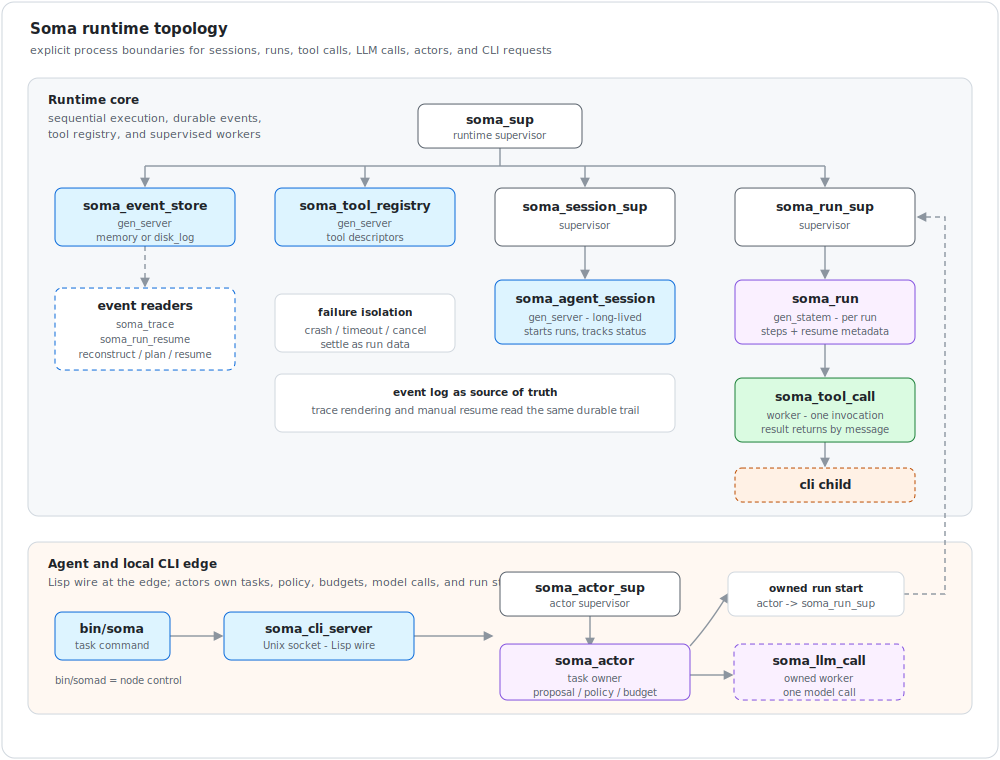
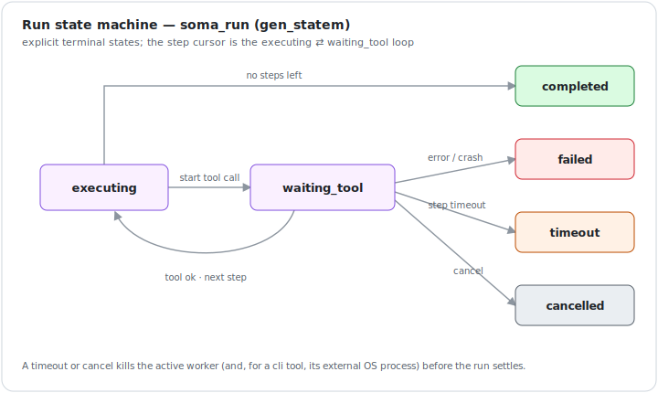

# Soma — design north star

> Soma's design north star — the thesis, the runtime shape, and the
> non-negotiable constraints — covering the current runtime: v0.1's execution
> core and v0.2's tool manifests + CLI/port adapter. It keeps the aspirational
> voice of the original spec; for **what is actually built and how to run it**,
> see the [README](../README.md). Where the implementation refined the design
> (e.g. step iteration lives inside `soma_run` rather than a separate `soma_step`
> process, tools register as `file_read` / `file_write`, and a `cli` tool's port
> is owned by `soma_tool_call` rather than a separate `soma_port_tool` process),
> the README and the code are authoritative.

Soma is an Erlang/OTP-native agent runtime.

The first version is a small runtime that proves one idea:

```text
An agent system should be built as supervised Erlang processes, not as one
large loop that happens to call tools.
```

The foundation is Erlang agent execution: sessions, runs, tool calls, events,
timeouts, cancellation, and failure isolation.

## Thesis

Agent systems fail in operational ways:

- model calls hang;
- tools time out;
- external programs crash;
- user sessions stay alive for a long time;
- partial writes need guardrails;
- cancellation must be real;
- every run needs an audit trail;
- failures must not poison the whole session.

Erlang/OTP is unusually well suited to these problems. Soma uses the parts of
Erlang that are hard to reproduce cleanly elsewhere:

- lightweight processes;
- isolated mailboxes;
- supervision trees;
- `gen_server` for long-lived actors;
- `gen_statem` for run state machines;
- links and monitors;
- timers and cancellation messages;
- ports for external tool processes;
- crash isolation as a design primitive.

## Core Principle

Soma is built on the **actor model**: every session, run, and tool call is an
actor — an isolated process with a private mailbox, communicating only by
message-passing. Erlang/OTP is the canonical actor runtime; its supervision trees
and monitors add the fault-tolerance layer the thesis depends on.

Do not implement an agent run as a normal function.

Implement it as an OTP process tree:

```text
soma_agent_session             long-lived gen_server
  |
  v
soma_run                       per-run gen_statem
  |
  +-- soma_step                per-step worker process
  |
  +-- soma_tool_call           per-tool-call worker process
  |
  +-- soma_port_tool           optional external OS process / port
```

The plan or step list tells the runtime what to start. Erlang/OTP provides the
execution semantics: message flow, timeout, cancellation, monitoring, failure
isolation, and restart policy.

## Scope

Soma is an Erlang agent runtime — the execution core plus a tool layer, nothing
above it.

In scope (built across v0.1 and v0.2):

- session process;
- run process;
- sequential steps;
- supervised tool calls, each behind a process boundary;
- timeout and cancellation, including teardown of a cli tool's external OS process;
- a tool registry over normalized manifests (descriptors);
- in-BEAM tools and a one-shot CLI/port adapter;
- normalized cli failures (bounded, named errors);
- event emission and in-memory event store;
- end-to-end tests around process behavior;
- a self-contained release (macOS arm64 built; Linux `x86_64` and `arm64` remaining).

Out of scope (later roadmap layers):

- an LFE DSL over the step list;
- an MCP client adapter;
- an LLM planner;
- DAG parallelism;
- distributed Erlang;
- persistent run resume.

The release should be useful because it is reliable, not because it has many
integrations.

## Done Means

A layer is done when the runtime can execute a sequential run and prove its
failure semantics under test — process survival, not just return values.

Required demo:

```text
file_read -> echo -> file_write
```

Required guarantees (proven for both in-BEAM and cli tools):

- a tool crash does not kill the session;
- a hanging tool is stopped by timeout — for a cli tool the external OS process is killed too;
- cancelling a run stops the active tool, and its external process;
- a cli tool's operational failures (missing/unrunnable executable, nonzero exit, oversized output) become bounded `{error, _}` data, not a session crash;
- the event log explains the run from start to terminal state;
- a session can start another run after failure, timeout, or cancellation.

Release targets (one artifact per architecture):

```text
macOS arm64   (built and verified)
Linux x86_64  (remaining)
Linux arm64   (remaining)
```

## Runtime Shape

Suggested supervision tree:

```text
soma_sup
  |
  +-- soma_event_store
  |
  +-- soma_tool_registry
  |
  +-- soma_session_sup
  |     |
  |     +-- soma_agent_session
  |
  +-- soma_run_sup
        |
        +-- soma_run
              |
              +-- soma_step
              |
              +-- soma_tool_call
```

As built — `soma_step` is folded into `soma_run`'s state cursor, and a `cli`
tool's port is owned by `soma_tool_call`:



The session process is long lived. It owns conversation/session metadata and
starts runs.

The run process is short lived. It owns one execution attempt and should be a
`gen_statem`.

The tool call process is disposable. It executes one tool invocation and dies
after returning a result or error.

## Agent Session

`soma_agent_session` should be a `gen_server`.

Responsibilities:

- own `session_id`;
- accept a run request;
- start `soma_run` under `soma_run_sup`;
- track active runs;
- receive run completion messages;
- expose session status;
- survive failed runs.

The session process must not execute tool logic directly.

Example messages:

```erlang
{start_run, RunRequest}
{cancel_run, RunId}
{run_completed, RunId, Result}
{run_failed, RunId, Reason}
get_status
```

## Agent Run

`soma_run` should be a `gen_statem`.

Minimum run states:

```text
accepted
  -> executing
  -> waiting_tool
  -> completed

accepted
  -> executing
  -> failed

accepted
  -> executing
  -> cancelled

accepted
  -> executing
  -> timeout
```



The run process owns:

- step cursor;
- step results;
- active tool call pid;
- run timeout timer;
- cancellation handling;
- event emission.

The run process starts each tool call as a child process or supervised worker.
It should monitor the worker. A tool crash is data for the run, not a crash of
the session.

## Steps, Not IR Yet

Soma uses a deliberately small step list — not a full IR yet.

Example:

```erlang
[
  #{
    id => read,
    tool => file_read,
    args => #{path => <<"input.txt">>},
    timeout_ms => 1000
  },
  #{
    id => echo,
    tool => echo,
    args => #{from_step => read},
    timeout_ms => 1000
  },
  #{
    id => write,
    tool => file_write,
    args => #{path => <<"output.txt">>, from_step => echo},
    timeout_ms => 1000
  }
]
```

The executor is sequential:

```text
validate step
start tool call
wait for result
record event
move to next step
```

No branching, no loops, no DAG, no variables beyond simple prior-step output
references.

## Tool Runtime

A tool is a small Erlang behavior:

```erlang
-callback describe() -> soma_tool:spec().
-callback invoke(soma_tool:input(), soma_tool:ctx()) ->
    {ok, soma_tool:output()} | {error, soma_tool:error()}.
```

Tool metadata:

```erlang
#{
  name => echo,
  effect => identity,
  idempotent => true,
  timeout_ms => 1000
}
```

Minimum effects:

```text
identity   pure computation or local lookup
reader     reads external state
state      mutates external state
```

v0.1 tools:

```text
echo        returns its input
sleep       waits for N milliseconds
fail        returns an error or crashes, used for tests
file.read   reads a file under a sandbox root
file.write  writes a file under a sandbox root
```

Mock LLM can be added as a local tool:

```text
llm.mock    deterministic response, no network
```

Real LLM providers should wait until the runtime behavior is proven.

### Manifests and adapters

A tool registers through a **manifest** — its `describe/0` metadata plus an
`adapter` and adapter-specific fields — validated and normalized by
`soma_tool_manifest:normalize/1` into the descriptor the registry stores
(`name => descriptor`, resolved with `resolve_descriptor/1`). A manifest missing
a required field, or carrying a bad `effect` / `idempotent` / `timeout_ms`, is
rejected before it ever reaches the registry, so malformed tools fail fast rather
than mid-run.

Two adapters exist:

```text
erlang_module   an in-BEAM tool:   #{adapter => erlang_module, module => Mod}
cli             a one-shot external executable: #{adapter => cli, executable, argv}
```

Each built-in exposes `manifest/0` = `(describe())#{adapter => erlang_module,
module => ?MODULE}`, so the in-BEAM tools register through the same machinery
external tools use. A `cli` manifest names a bare `executable` plus a separate
`argv` list — never a shell command string.

## External Processes

External tools are isolated behind tool workers. The one-shot CLI adapter lives
in `soma_tool_call`: when a step resolves to a `cli` descriptor, the worker
launches the executable through a port (`open_port({spawn_executable, ...})`).
Long-running ports stay out of scope until the runtime semantics need them.

Important rule:

```text
Use executable + args, not shell command strings.
```

The adapter uses executable + argv separation; there is no shell anywhere on the
path — not for launching a tool, and not for the teardown that kills a child's OS
process (that goes through `os:find_executable("kill")` + a port, never
`os:cmd`). Shell interpolation is not part of the core.

The cli protocol: the step input is delivered as the **final argv argument** (an
Erlang port cannot half-close the child's stdin), the process's stdout is
captured as the step output, and exit status 0 is success; any other exit, a
missing/unrunnable executable, or output past a byte limit becomes a bounded
`{error, _}`. The child runs with a minimal environment (only `PATH`) and a fixed
working directory. On timeout or cancellation the worker is killed and the
external OS process with it. The full contract is in
[tool-manifest.md](tool-manifest.md).

Any external executable used by the release must be packaged per target
architecture — a macOS arm64, a Linux `x86_64`, and a Linux `arm64` release are
separate artifacts, each carrying only its own helper.

## Event Log

Events are mandatory. Without events, the runtime cannot be audited or
debugged.

Minimum events:

```text
session.started
run.accepted
run.started
step.started
tool.started
tool.succeeded
tool.failed
step.succeeded
step.failed
run.completed
run.failed
run.cancelled
run.timeout
```

Every event should carry:

```text
event_id
timestamp
session_id
run_id
step_id
tool_call_id
event_type
payload
```

The first implementation should use an in-memory event store for tests. A
persistent store can be added after the process semantics are covered. The
runtime should emit events from day one, even if the first store is memory-only.

## Cancellation And Timeout

Cancellation is a runtime feature, not a flag checked at the end.

Expected behavior:

- cancelling a run sends a message to `soma_run`;
- `soma_run` cancels or kills the active tool call;
- the tool call process exits;
- the run records `run.cancelled`;
- the session remains alive.

Timeout behavior:

- run timeout is owned by `soma_run`;
- tool timeout is owned by the tool call process or run process;
- timeout must end the active tool call;
- timeout must produce an event.

## Failure Semantics

The first version should make failure boring.

Required cases:

- a tool returns `{error, Reason}`;
- a tool process crashes;
- a tool process hangs;
- a run is cancelled while a tool is running;
- a session starts two runs;
- a run fails without killing the session;
- the event store records enough information to explain the failure.

This is where Erlang matters. These cases should be modeled as process and
message behavior, not as a pile of defensive `try/catch` calls.

## Implementation Constraints

- `soma_run` owns run state; tools do not mutate run state directly.
- `soma_agent_session` never executes tools.
- every tool invocation has a process boundary.
- tool results are messages back to `soma_run`.
- terminal run states are explicit: `completed`, `failed`, `cancelled`,
  `timeout`.
- tests should assert process survival, not only returned values.

## Repository Direction

Potential layout:

```text
soma/
  apps/
    soma_runtime/
      src/
        soma_app.erl
        soma_sup.erl
        soma_agent_session.erl
        soma_run.erl
    soma_tools/
      src/
        soma_tool.erl
        soma_tool_registry.erl
        soma_tool_call.erl
        soma_tool_echo.erl
        soma_tool_sleep.erl
        soma_tool_fail.erl
        soma_tool_file_read.erl
        soma_tool_file_write.erl
    soma_event_store/
      src/
        soma_event_store.erl
        soma_event_store_memory.erl
  test/
  examples/
    sequential_file_run/
  docs/
    runtime.md
    tool-behaviour.md
    event-model.md
    roadmap.md
```

## Test Contract

Every layer proves its process behavior under test before the next layer is
added. The v0.1 contract, proven end-to-end:

1. a session starts;
2. a run is accepted;
3. steps execute sequentially;
4. each tool call has its own process boundary;
5. events are emitted;
6. a failing tool fails the run;
7. a crashed tool does not kill the session;
8. a hanging tool times out;
9. cancelling a run stops the active tool;
10. the session can start another run afterward.

The v0.2 contract extends it without weakening it: manifests validate before
registration; built-ins run through manifests; a `cli` tool succeeds through the
real session/run/tool-call layers with its own worker pid and the same event
trail; and nonzero / missing / hanging / cancelled `cli` runs fail-or-stop — with
the external OS process verifiably gone — while the session survives and runs
again. Each proof is mapped to the suite and case that proves it in
[v0.2-test-contract.md](v0.2-test-contract.md).

This test contract is more important than adding tool integrations.

## Design Principles

- Agents are actors.
- Runs are state machines.
- Tool calls are isolated processes.
- Events explain everything.
- Cancellation must be real.
- The first version should be small.
- Erlang's supervision model is the product advantage.

## First Commit Checklist

- Create a rebar3 umbrella.
- Add `soma_runtime` OTP application.
- Add `soma_agent_session` as a `gen_server`.
- Add `soma_run` as a `gen_statem`.
- Add `soma_tool` behavior.
- Add echo, sleep, fail, file.read, and file.write tools.
- Add in-memory event store.
- Add a sequential run example.
- Add the v0.1 test contract.
