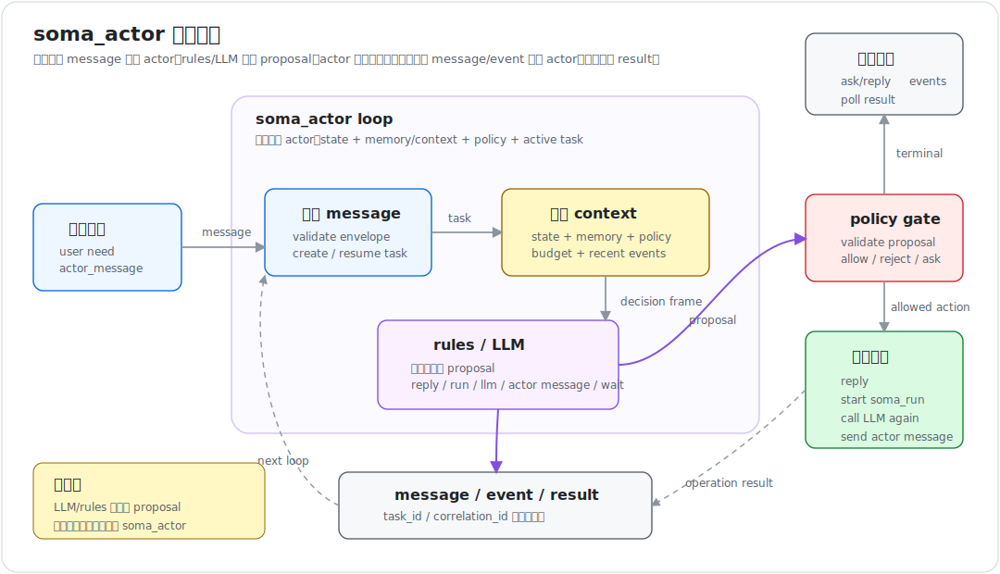
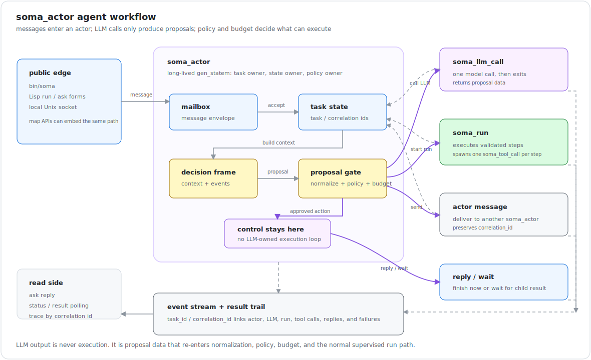

# `soma_actor` 设计

> **构建状态：** v0.4 的 actor 最小切片已经实现并验证：`soma_actor` 作为
> `gen_statem` 起来、收信封（`send`/`ask`）、建任务、跑自己拥有的 `soma_run`、
> 出结果或在失败/超时/取消时存活，`by_correlation/2` 串起整条链。v0.5 又实现了
> LLM call worker、proposal schema、policy gate、budget 和 actor-to-actor message；
> v0.6 让事件流可读并可选持久化；v0.7.1-v0.7.4 加上了持久化 run journal、
> reconstruct、resume plan 和手动 resume executor。测试契约见
> [`../contracts/v0.4-test-contract.md`](../contracts/v0.4-test-contract.md)、
> [`../contracts/v0.5-test-contract.md`](../contracts/v0.5-test-contract.md) 和
> [`../contracts/v0.6-test-contract.md`](../contracts/v0.6-test-contract.md)、
> [`../contracts/v0.7-test-contract.md`](../contracts/v0.7-test-contract.md)。当前测试门禁
> 使用 mock/fixed-response seams；真实 OpenAI-compatible provider 已经通过
> `model_config` 接入，`plan => true` 可把 provider 回复解析成 `(run-steps ...)`
> proposal，live 调用是 opt-in。可运行示例见 `examples/soma_actor_demo.erl`，
> 用户手册见 [`../usage.md`](../usage.md)。

本文是 `soma_actor` 的完整设计说明。它不替代已经实现的执行内核（session、run、tool call、manifest、CLI adapter、LFE DSL），而是说明这个执行内核在最终 agent runtime 里的位置，以及 `soma_actor` 这一层如何在它之上构建。

核心结论：

```text
Soma 使用 Erlang/OTP 的 actor model 构建 agent entity：soma_actor。

soma_actor 通过 message 被触发，拥有 state、memory/context、model config、
tool policy 和 active tasks。

soma_actor 发起 LLM call、soma_run、tool call 或 actor-to-actor message。

LLM/rules 只产生 proposal；状态转移、policy 校验和执行权属于 soma_actor。

结果通过 task_id / correlation_id 关联，并通过 reply、event stream 或 polling 获取。
```

注：OTP 是 **Open Telecom Platform**——Erlang 构建可靠并发系统的标准库、框架和设计模式。Erlang/OTP 基础概念见 [erlang-otp-primer.zh.md](erlang-otp-primer.zh.md)。

## 核心定义

`soma_actor` 是一个长期存在、具备 LLM call 能力的 actor 实体：

```text
soma_actor
  = Erlang/OTP process
  = mailbox
  = private state
  = memory/context references
  = model configuration
  = tool policy
  = active tasks/runs
  = supervised lifecycle
```

**`soma_actor` 是 agent entity；LLM call 是它的能力；message passing 是它和其他 actor 的交互方式；`soma_run` 是它执行确定 steps 的运行路径。**

`soma_actor` 不是把一个 LLM call 包成 Erlang process 就结束了。它是一个有身份、状态、上下文和策略的长期实体。

## 总体结构

```text
soma_actor                    long-lived LLM-capable agent entity
  |
  +-- memory/context refs      actor-owned context and retrieval boundary
  |
  +-- soma_llm_call            supervised LLM call; returns proposal
  |
  +-- soma_run                 supervised execution attempt for known steps
  |     |
  |     +-- soma_tool_call     isolated per-step tool invocation
  |
  +-- actor message            message to another soma_actor
```

Actor loop：



Message-driven workflow：



## Erlang/OTP 映射

`soma_actor` 与 Erlang actor model 的映射：

```text
actor identity       -> actor_id + Erlang pid / registry entry
mailbox              -> Erlang process mailbox
private state        -> gen_server/gen_statem state
message passing      -> Erlang messages
supervision          -> OTP supervisor
failure isolation    -> links, monitors, restart policy
timeouts             -> timers / gen_statem state_timeout
cancellation         -> message + child process teardown
```

Agent 语义由 Soma 在这个基底上补齐：

```text
message envelope
task_id / correlation_id
memory/context loading
LLM provider/model config
tool policy and permissions
run ownership
result storage
event schema
budget and loop limits
backpressure and mailbox policy
actor-to-actor routing
```

推荐实现形态：

```text
soma_actor_sup
  └── soma_actor          gen_statem; long-lived agent entity

soma_llm_call_sup
  └── soma_llm_call       disposable worker; one model call

soma_run_sup
  └── soma_run            gen_statem; one execution attempt
        └── soma_tool_call
```

`soma_actor` 自身不阻塞在 LLM call 或 run 上。它启动并监控子操作，子操作结果作为 message 回到 actor mailbox。

## 稳定名寻址

除了 pid，`soma_actor` 还支持用一个稳定的二进制名字寻址。`soma_actor_sup:start_actor/1`
接受 `stable_name` 这个**启动选项**：启动 actor 时传入一个二进制 `stable_name`，
actor 的 `init/1` 就会把这个名字通过 `soma_actor_registry:register/2` 注册到
`soma_actor_registry`（一个由 `soma_actor_sup` 监督的 `gen_server`，维护
`二进制名字 => pid` 的映射）。之后 `soma_actor:send/2` 和 `actor_message.to`
既接受 pid，也接受这个二进制稳定名。

```erlang
%% stable_name 是一个启动选项
{ok, ActorPid} = soma_actor_sup:start_actor(#{stable_name => <<"researcher">>}).
```

## Message 是入口

`soma_actor` 的工作入口是 message。外部函数 API 只是 envelope 的包装，不绕过 actor mailbox：

```erlang
soma_actor:send(ActorPid, Envelope).
soma_actor:ask(ActorPid, Envelope, Timeout).
```

最小 envelope：

```erlang
#{
  message_id => <<"msg-1">>,
  task_id => <<"task-1">>,
  correlation_id => <<"task-1">>,
  from => <<"user:liz">>,
  to => <<"actor:researcher">>,
  type => user_message,
  payload => #{text => <<"summarize this file">>},
  reply_to => undefined,
  timestamp => 123456789
}
```

触发来源：

- 用户消息；
- 另一个 `soma_actor` 的 message；
- system event：timer、webhook、外部事件；
- run / llm / tool 的结果；
- control message：cancel、pause、resume、shutdown、update_policy。

`correlation_id` 必须跨 actor 传播，用于追踪整条任务链。Actor 之间通信同样走 envelope，不应该通过直接函数调用共享内部状态。

## Actor Loop

`soma_actor` 的工作不是无限 while loop，而是 event-driven state machine：

```text
incoming message / event
  -> update actor / task state
  -> load memory / context
  -> build decision frame
  -> decide next action
  -> validate proposal through policy gate
  -> execute action
  -> receive result event / message
  -> next loop or terminal result
```

一条 message 进入 actor 后的典型处理流程：

```text
receive message
  -> validate envelope
  -> check policy / permissions
  -> emit actor.message.received
  -> create or resume task
  -> load memory / context
  -> decide next action:
       a) direct reply
       b) call LLM to produce reply
       c) call LLM to produce steps
       d) start soma_run with known steps
       e) send message to another actor
  -> observe LLM / run / tool events
  -> update memory / context
  -> emit actor.result.created
  -> send reply or downstream message
```

可选状态：

```text
idle
  -- actor_message --> thinking

thinking
  -- proposal accepted --> running | waiting_llm | replying | waiting

waiting_llm
  -- llm_result --> thinking

running
  -- run_completed/run_failed/run_timeout/run_cancelled --> thinking

paused
  -- resume --> idle | thinking
```

状态名可以调整，但控制权必须在 `soma_actor`，不是 LLM。

## Decision Frame

`soma_actor` 每次决定下一步时应构建一个 decision frame：

```erlang
#{
  actor_id => ActorId,
  task_id => TaskId,
  correlation_id => CorrelationId,
  actor_state => ActorState,
  task_state => TaskState,
  input_message => Envelope,
  memory_context => RetrievedMemory,
  active_runs => ActiveRuns,
  recent_events => RecentEvents,
  model_config => ModelConfig,
  tool_policy => ToolPolicy,
  budget => Budget,
  allowed_actions => AllowedActions
}
```

作用：给 rules / LLM 足够上下文；限制可选 action；让每次决策可审计；让 policy gate 做确定性校验；让 debug 可以复原 actor 为什么进入下一步。

## Rules 与 LLM

当 envelope 带有固定 steps 时，不需要 LLM：

```text
given steps
  -> validate steps
  -> start soma_run
  -> execute sequentially
  -> emit events
  -> terminal result
```

动态流程才需要 LLM：

```text
message
  -> build context
  -> rules cannot decide
  -> soma_llm_call
  -> proposal
  -> policy validate
  -> execute
```

LLM 在 `soma_actor` 里有两个角色，不能混：

- **planner LLM**：帮 `soma_actor` 把意图和 context 编译成 steps proposal；
- **tool LLM**：是 `soma_run` 中某一步的工具调用，和 `file_read`、`echo` 同级。

```erlang
%% LLM 作为 step 里的 tool
[
  #{id => read,      tool => file_read,
    args => #{path => <<"input.txt">>, root => Root}},
  #{id => summarize, tool => llm_call,
    args => #{prompt => {from_step, read}}, timeout_ms => 30000},
  #{id => write,     tool => file_write,
    args => #{path => <<"summary.txt">>, root => Root,
              bytes => {from_step, summarize}}}
]
```

动态 agent loop 在 `soma_actor` 层。`soma_run` 不应该变成"LLM 每步临时决定下一步"的大循环；它只负责可靠执行一段已经确定的 steps。

LLM 输出必须是结构化 proposal，不是自由文本控制系统。允许的 proposal action：

```text
reply / call_llm / start_run / send_actor_message
/ wait / request_user_input / complete_task / fail_task
```

当 proposal 包含 run steps 时，优先把它看作 agent intent language 的输出：
Lisp 风格 DSL、JSON 或其他前端都只是 authoring surface，必须先编译/规范化成
canonical step list，再经过 policy gate。`soma_actor` 不执行“语言文本”本身，
只执行通过校验的 proposal。

示例：

```erlang
#{
  action => start_run,
  reason => <<"Need to read and summarize the file">>,
  steps => [...]
}
```

## Policy Gate

LLM/rules 给出的 proposal 必须先通过 policy gate，才能执行。需要校验：

- action 是否允许；
- step schema 是否有效；
- tool 是否注册、是否被该 actor 授权；
- timeout 是否明确；
- budget 是否足够；
- 是否触发 dangerous action、是否需要用户确认；
- actor-to-actor message 是否允许；
- memory namespace 是否可读写；
- hop count / ttl 是否超过限制。

Policy gate 输出：`allow` / `reject` / `ask_user` / `revise_with_constraints` / `fail_task`。

LLM 不拥有执行权。`soma_actor` 拥有执行权。

## LLM Call

`soma_llm_call` 是一次受监督的 model call，由 `soma_actor` 发起：

```text
soma_actor
  -> starts soma_llm_call
  -> gives context + allowed action schema
  <- receives llm_result / proposal
  -> validates through policy gate
  -> executes or rejects
```

Actor 可以把自己的部分能力包装成 tools 暴露给 LLM：

```text
read_memory / write_memory / start_run / send_message_to_actor / request_user_input
```

这些是 actor 授权的 tool surface。LLM 只能请求调用；actor 决定是否执行。

## Run Execution

`soma_actor` 发起 run，通过 run result message / event 观察结果：

```text
soma_actor
  -> start soma_run with validated steps
  -> state = running
  <- run_completed / run_failed / run_timeout / run_cancelled
  -> update task state
  -> next loop or final result
```

`soma_run` 保持已有的执行职责：顺序执行 steps、每个 tool invocation 跨进程边界、timeout 真实杀掉 active worker、cancel 真实停止 active worker、failure 进入 terminal state、events 记录完整轨迹、actor 存活。

`soma_actor` 不直接执行工具逻辑。

## Result Model

每个 actor task 必须有 `task_id`、`correlation_id`、status、result or error、event trail。结果获取有三种方式。

### `ask/reply`

短任务便利 API：

```erlang
{ok, Result} = soma_actor:ask(ActorPid, Envelope, 30000).
```

底层仍然是 message：`caller -> actor_message -> soma_actor -> work -> actor_reply -> caller`。

### `task_id + events`

长任务和 UI 主路径：

```erlang
{ok, TaskId} = soma_actor:send(ActorPid, Envelope).
Events = soma_event_store:by_correlation(StorePid, TaskId).
```

`by_correlation/2` 是 event-store 层需要补的能力。Event stream 是事实来源，一个完整任务的事件链：

```text
actor.message.received -> actor.task.accepted -> actor.context.loaded
-> llm.started -> llm.succeeded -> actor.proposal.created -> actor.policy.allowed
-> run.accepted -> run.started -> step.started -> tool.started
-> tool.succeeded -> step.succeeded -> run.completed
-> actor.result.created -> actor.task.completed
```

失败、超时和取消同样进入事件流。

### `poll status/result`

简单集成 API：

```erlang
soma_actor:get_task_status(ActorPid, TaskId).
soma_actor:get_task_result(ActorPid, TaskId).
```

```erlang
#{
  task_id => <<"task-1">>,
  correlation_id => <<"task-1">>,
  status => running | completed | failed | timeout | cancelled,
  result => ResultOrUndefined,
  error => ReasonOrUndefined
}
```

三种方式的原则：短任务可以 `ask` 到结果；长任务可以订阅 events；系统崩溃或调试时可以从 event log 还原发生过什么。Reply 和 polling 是 event stream 的便利接口。

## Event Contract

Actor 层扩展现有 event model，每个事件仍应携带：

```text
event_id / timestamp / session_id / actor_id / task_id / correlation_id
/ run_id / step_id / tool_call_id / llm_call_id / event_type / payload
```

其中 `actor_id / task_id / correlation_id / llm_call_id` 是 actor 层新增字段。

Actor event 类型：

```text
actor.started
actor.message.received / actor.task.accepted / actor.context.loaded
actor.decision.started / actor.proposal.created
actor.policy.allowed / actor.policy.rejected
actor.action.started / actor.action.succeeded / actor.action.failed
actor.result.created / actor.message.sent
actor.task.completed / actor.task.failed / actor.task.cancelled
```

LLM event 类型：

```text
llm.started / llm.succeeded / llm.failed / llm.timeout / llm.cancelled
```

## Memory Model

`soma_actor` 的 memory 分层：

```text
actor_state        small, hot, private process state
task_state         per task progress and active operations
short_context      constructed context for current decision frame
memory_refs        references to long-term memory backend
event_log          immutable trail
result_store       task final results and summaries
```

原则：actor process state 保持小而热；长期 memory 放在后端或外部 store；context 每轮构建；event log 记录事实；memory namespace 受 policy 控制。

## Budget、Backpressure 与 Loop 限制

每个 task 必须有预算和终止条件：

```text
max_llm_calls / max_runs / max_tool_calls / max_actor_messages
/ max_actor_hops / max_wall_time_ms / max_tokens / max_event_count
```

Actor mailbox 需要 backpressure 策略：

```text
queue_limit / priority / deadline / dedupe_key / drop_or_reject_policy / pause_resume
```

Actor-to-actor message 必须带 `correlation_id / hop_count / ttl / trace`，避免互相委托形成 runaway loop。

## Failure Semantics

失败必须分层记录，不能混成一个 `error`：

```text
llm_call failed       -> 推理操作失败
tool_call failed      -> 某个工具调用失败
run failed            -> 一次 steps 执行失败
task failed           -> actor 的一个 task 失败
actor crashed         -> actor 进程崩溃，由 supervisor 处理
```

Actor 层处理原则：child operation crash 是 actor 收到的 data；cancel task 要取消 active LLM call / run；timeout task 要停止 active operations；actor crash 后 supervisor 根据策略重启。

## 最小 API

```erlang
soma_actor:start_link(Opts) -> {ok, ActorPid}.

soma_actor:send(ActorPid, Envelope) ->
    {ok, TaskId} | {error, Reason}.

soma_actor:ask(ActorPid, Envelope, TimeoutMs) ->
    {ok, Result} | {error, Reason} | timeout.

soma_actor:cancel(ActorPid, TaskId) ->
    ok | {error, Reason}.

soma_actor:get_status(ActorPid) ->
    #{actor_id := ActorId, status := Status, tasks := Tasks}.

soma_actor:get_task_status(ActorPid, TaskId) ->
    #{task_id := TaskId, status := Status}.

soma_actor:get_task_result(ActorPid, TaskId) ->
    {ok, Result} | {error, Reason} | not_ready.
```

这些 API 是 message 模型的外壳，不绕过 actor mailbox。

## 最小切片

`soma_actor` 骨架先实现核心能力，不急着做完整 LLM planner：

```text
1. start soma_actor with actor_id, model_config, tool_policy
2. receive Envelope through send/ask
3. create task_id / correlation_id
4. emit actor.message.received / actor.task.accepted
5. fixed-rule decision:
     - Envelope has steps -> validate and start soma_run
     - Envelope has reply payload -> create result
6. observe run terminal result
7. emit actor.result.created / actor.task.completed or failed
8. support ask/reply
9. support get_task_status / get_task_result
10. support event lookup by correlation_id
11. support cancel task -> cancel active run
```

历史上先用 deterministic mock proposal worker 证明 actor loop；现在
`soma_llm_call`、structured proposal schema、policy gate、budget 和 actor-to-actor
message 都已经落地。mock 仍是测试门禁默认路径，真实 provider 是配置开启的 opt-in 路径。

## Test Contract

测试必须继续遵守 Soma 的原则：证明进程行为，不只是返回值。

1. actor starts and emits `actor.started`;
2. actor receives message and creates task / correlation id;
3. actor can run fixed steps through `soma_run`;
4. run completion produces actor result;
5. `ask` receives final reply;
6. long task can be queried by `task_id`;
7. events can be queried by `correlation_id`;
8. actor survives run failure;
9. actor survives tool crash;
10. cancel task cancels active run;
11. actor can accept another message after failure / cancel / timeout;
12. actor-to-actor message preserves correlation id;
13. budget exhaustion fails task, not actor;
14. policy rejection fails or asks, not actor;
15. actor process remains responsive while LLM / run child is active.

## 非目标

最小切片不做完整 LLM planner、DAG、MCP、持久 resume、复杂 memory backend。

不让 `soma_run` 变成动态 agent loop。

不让 `soma_actor` 直接执行工具逻辑。

不把所有状态塞成一个不可拆的巨大 state map。

不只返回最终字符串而丢掉中间事件。

## 不可变设计合同

`soma_actor` 是 agent entity。

`soma_actor` 通过 message 被触发。

`soma_actor` 之间通过 message 通信。

`soma_actor` 具备 LLM call 能力。

LLM/rules 产生 proposal；`soma_actor` 校验 proposal，并拥有状态转移和执行权。

`soma_actor` 发起 `soma_run` 执行确定 steps。

`soma_run` 保持可靠执行路径：顺序 steps、process boundary、timeout、cancel、failure isolation、events。

结果通过 `task_id` / `correlation_id` 关联，并通过 reply、event stream 或 polling 获取。

Event stream 是事实来源。
